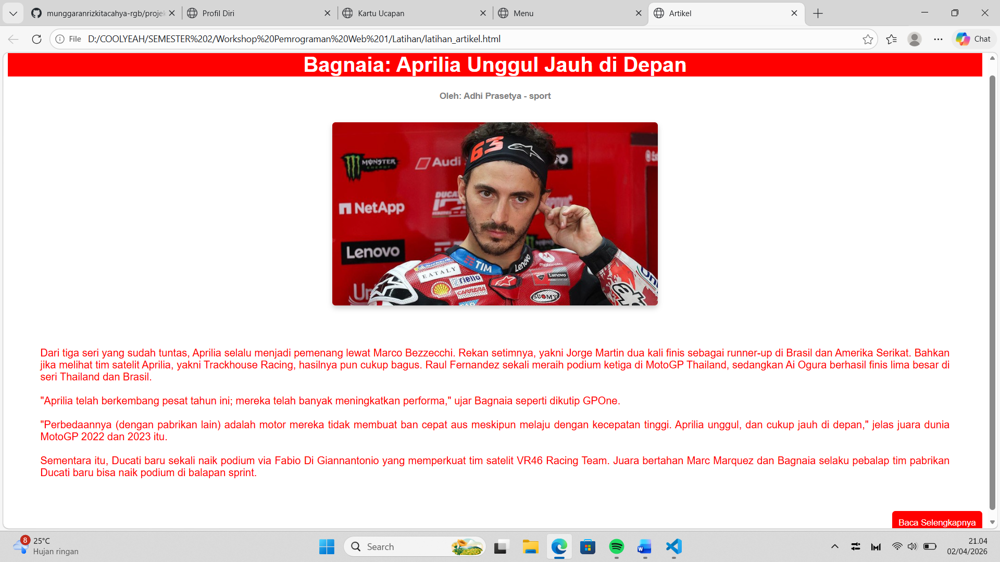
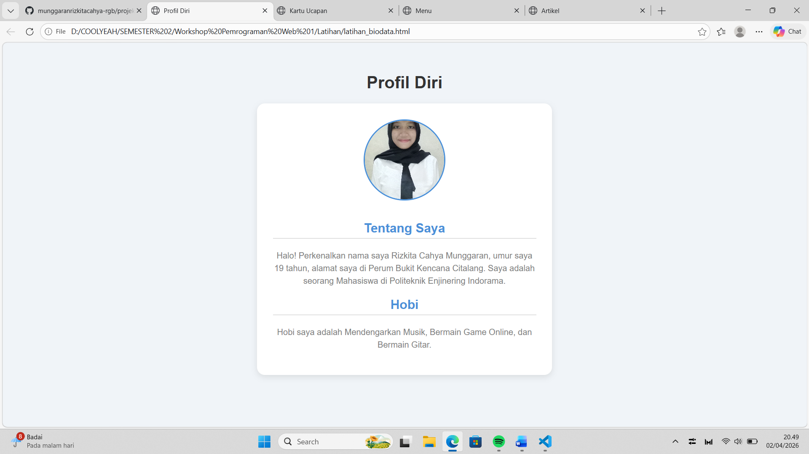
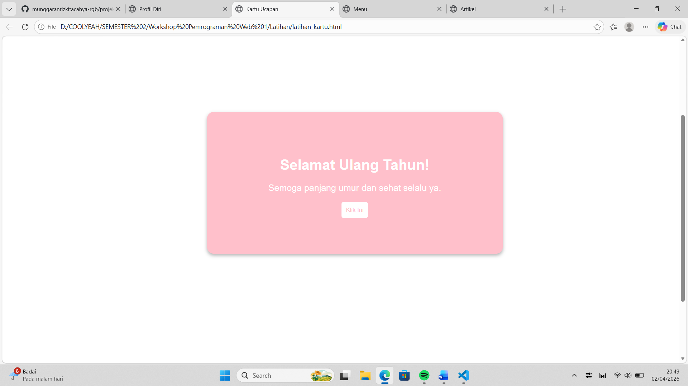
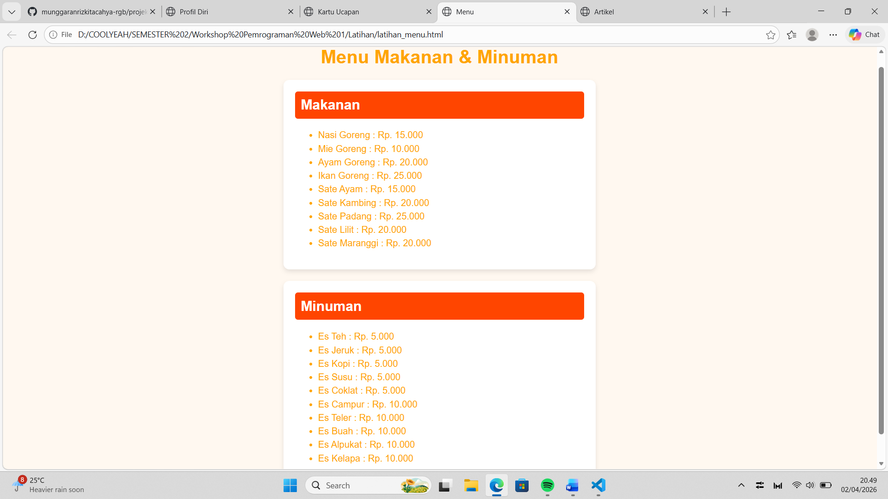

# 🌐 Website Sederhana HTML

## 📖 Deskripsi
Project ini merupakan website sederhana yang dibuat menggunakan HTML sebagai bagian dari pembelajaran Pemrograman Web 1. Website ini berisi beberapa halaman seperti artikel, biodata, menu makanan, dan kartu ucapan.

## 🎯 Tujuan
Tujuan dari project ini adalah untuk memahami dasar-dasar HTML, seperti:
- Struktur halaman web
- Penggunaan tag HTML
- Menampilkan teks dan gambar
- Membuat list
- Membuat tombol (button)

## ✨ Fitur
- Halaman artikel dengan gambar
- Halaman biodata / profil diri
- Halaman menu makanan dan minuman
- Halaman kartu ucapan
- Terdapat tombol interaksi
- Tampilan sederhana dan terstruktur

## 📄 Halaman yang Dibuat
- `latihan_artikel.html`
- `latihan_biodata.html`
- `latihan_kartu.html`
- `latihan_menu.html`

## 🛠️ Teknologi yang Digunakan
- HTML

## 🚀 Cara Menjalankan
1. Download atau clone repository ini
2. Buka salah satu file HTML di browser, seperti:
   - `latihan_artikel.html`
   - `latihan_biodata.html`
3. Website akan langsung ditampilkan

## 📷 Screenshots

### 📌 Halaman Artikel

### 📌 Halaman Biodata

### 📌 Halaman Kartu Ucapan

### 📌 Halaman Menu

